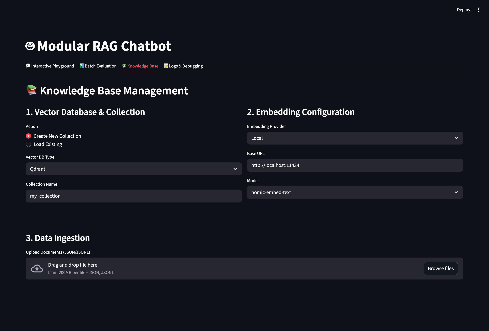
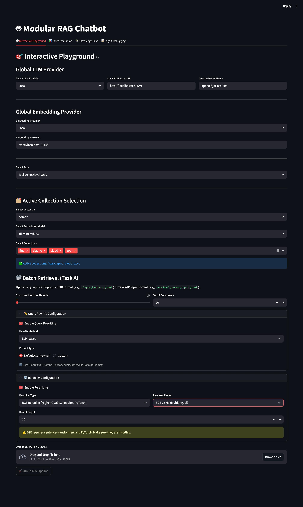
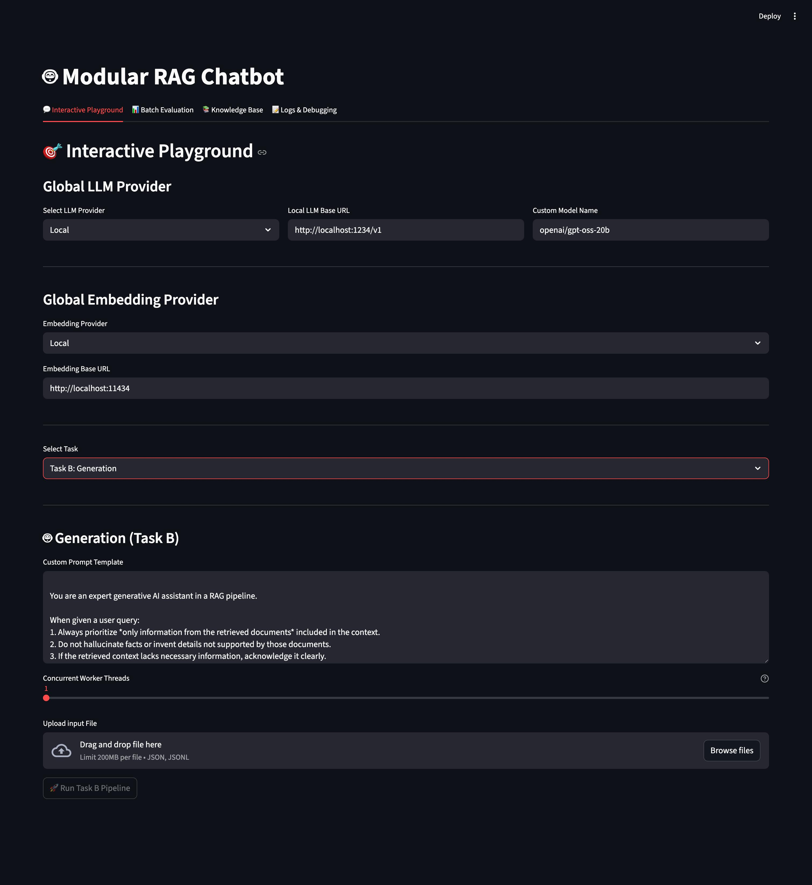
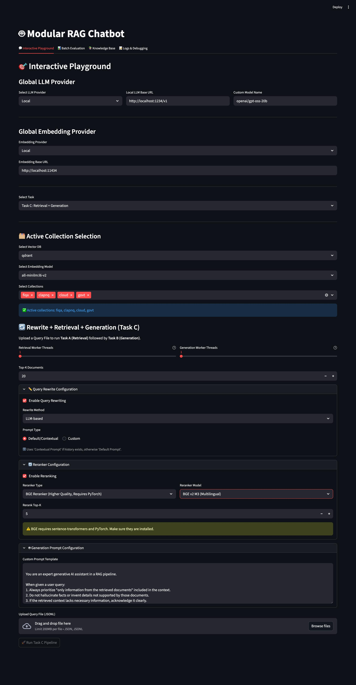
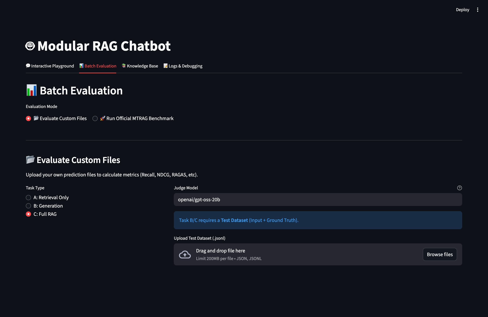

# MTRAGEval - Multi-Turn RAG Evaluation System

A modular Retrieval-Augmented Generation (RAG) system integrated with the **MTRAG Benchmark** for evaluating multi-turn conversational AI. Built with Streamlit, LangChain, FAISS and Qadrant.

## Features

- **MTRAG Benchmark Integration**: Official multi-turn RAG evaluation from IBM Research
- **Multi-Provider LLM Support**: Choose any local model suitable for your machine from Ollama or LMStudio
- **BEIR Format Support**: Standard benchmark data format for retrieval tasks
- **Multi-Turn History**: Proper conversation context handling for chat-based evaluation
- **Vector Store Options**: FAISS and Qdrant support

## Qdrant Setup (Docker)

To usage Qdrant as your vector store, you can run it via Docker using the official image:

```bash
# 1. Pull the official Qdrant image
docker pull qdrant/qdrant

# 2. Run Qdrant with persistent storage
# This maps port 6333 (API) and 6334 (GRPC) and creates a local 'qdrant_storage' directory
docker run -p 6333:6333 -p 6334:6334 \
    -v "$(pwd)/qdrant_storage:/qdrant/storage:z" \
    qdrant/qdrant
```

## Quick Start

If you are on Windows, make sure you do "git config --system core.longpaths true" before you clone the repository in order to be able to allow cloneing prediction/evaluation results

```bash
# Install dependencies
pip install -r requirements.txt

# Pull an embedding model
ollama pull nomic-embed-text

# Pull an LLM model
ollama pull llama3

# Run Streamlit UI
streamlit run app.py
```

## MTRAG Benchmark

### What is MTRAG?

MTRAG (Multi-Turn RAG) is a comprehensive benchmark dataset from IBM Research for evaluating RAG systems on multi-turn conversations. It includes:

- **4 Corpora**: ClapNQ, Cloud, FiQA, Govt
- **842 Evaluation Tasks**: Human-generated multi-turn conversations
- **3 Task Types**: Retrieval (A), Generation (B), Full RAG (C)

### Running Benchmarks

#### UI Mode

1. Open `http://localhost:8501`
2. Go to **📚 Knowledge Base** tab
3. Select pre-ingested collection or set up the configurations and upload a corpus to ingest
4. Go to **💬 Interactive Playground** tab
5. Select a Task (A, B, or C) to perform
6. Set up configurations necessary for each task accordingly (e.g Query Rewriting settings, Reranker settings, system prompts)
7. Upload a input file in the format "retrieval_taskac_input.jsonl" or "retrieval_taskb_input.jsonl"
8. Click on "Run Pipeline" and get your results

### Evaluation Metrics

| Task         | Metrics                                                   |
| ------------ | --------------------------------------------------------- |
| **Task A**   | Recall@K, nDCG@K                                          |
| **Task B/C** | Faithfulness, Appropriateness, Completeness, IDK Accuracy |

## UI Tabs

| Tab                       | Purpose                                                    |
| ------------------------- | ---------------------------------------------------------- |
| 💬 Interactive Playground | Generating predictions for each task                       |
| 📊 Batch Evaluation       | Evaluation of results obtained from Interactive Playground |
| 📚 Knowledge Base         | Configuration & collection set-up                          |
| 📝 Logs & Debugging       | For debugging and troubleshooting                          |

## Screenshots

### Knowledge Base Configuration



### Interactive Playground





### Batch Evaluation



## References

- [MTRAG Benchmark](https://github.com/IBM/mt-rag-benchmark) - Official benchmark repository
- [BEIR Benchmark](https://github.com/beir-cellar/beir) - Information retrieval benchmark format
- [LangChain](https://python.langchain.com/) - LLM orchestration framework

## License

MIT License
